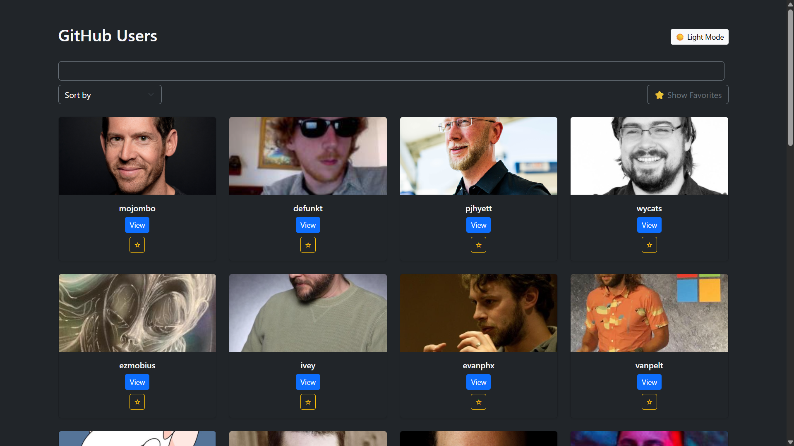
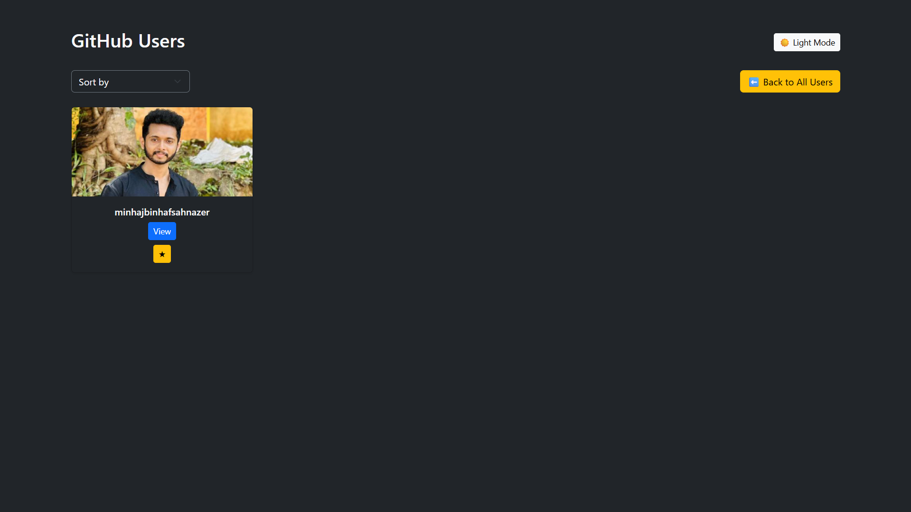

# 🚀 GitHub User Explorer

made with github api ⚙️

A sleek and fully responsive full-stack web application that allows users to **search, explore, and favorite GitHub profiles** with real-time interaction and a modern UI.  
Built using **React**, **Django REST Framework**, and **Bootstrap 5**, this project demonstrates frontend-backend integration, API consumption, state management, and dynamic UI features.

---

## 📸 Screenshots

### 🌙 Dark Mode with Favorites  

---

## ✨ Features

- 🔍 Live GitHub user search via input
- 🌙 Dark/Light mode toggle
- ⭐ Mark/unmark favorite profiles (stored in localStorage)
- 📦 Sort by followers or repository count (optional dropdown)
- ⚙️ Custom filtering and error handling
- 💻 Fully responsive UI (Bootstrap 5)
- 💾 LocalStorage integration for persistent favorites
- 🔄 Real-time debounce search
- 💅 Styled with CSS + Bootstrap + Dark theme support

---

## 🛠️ Tech Stack

### 🖥️ Frontend
- [React.js](https://reactjs.org/)
- React Hooks (`useState`, `useEffect`)
- Bootstrap 5
- Custom CSS

### 🌐 Backend
- [Django](https://www.djangoproject.com/)
- [Django REST Framework (DRF)](https://www.django-rest-framework.org/)
- GitHub API (external integration)
- CORS configuration

### 🧰 Tools Used
- VS Code
- Git & GitHub
- Git Bash / Terminal
- Chrome DevTools

